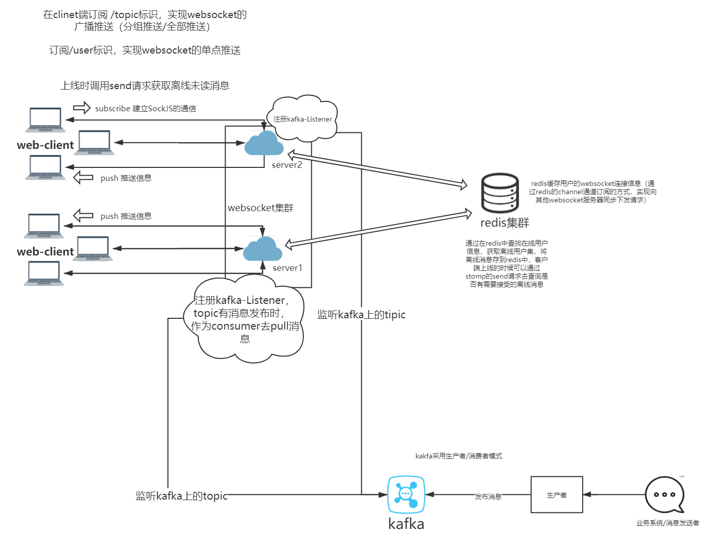

[通过消息推送实现管控预警文档说明](https://localhost:2277/ms)
===

> 基于SpringBoot+redis+websocket+STOMP协议实现的消息推送模块

* [目录](#control-alarm)
   * [环境](#环境)
   * [架构图](#架构图)
   * [功能](#功能)
      * [登入](#登入)
      * [发送消息](#发送消息)
      * [用户之间单对单发送消息](#用户之间单对单发送消息)
   * [后台实现逻辑要点](#后台实现逻辑要点)
      * [websocket配置](#websocket配置)
      * [redis配置](#redis配置)
      * [kafka配置](#kafka配置)
      
## 旧环境

* JDK1.8
* Maven
* IDEA

## 新环境

>（由于swagger还未支持用jakarta替换javax包，因此该优化版本暂时剔除swagger接口，后续再更新接入）

* JDK17
* Maven
* springboot3.0.0

## 架构图

## 前端功能演示界面

> http://localhost:2277/control-alarm/ws

### 登入
> http://localhost:2277/doc.html#/default/%E7%AE%A1%E6%8E%A7%E6%8A%A5%E8%AD%A6%E6%A8%A1%E5%9D%97/checkUsingPOST

点击检查按钮
> 登入成功后会将用户信息添加到session中

> 登入失败可能原因：参数输入异常

> 参数为 用户唯一标识id，用户名，分组id (针对不同的业务系统，需要拿到对应的用户-分组信息表)


点击连接，连接上线。

> 连接失败可能原因：1.用户未做登入检查 2.同一用户建立多个websocket连接

### 发送消息
> http://localhost:2277/doc.html#/default/kafka-%E6%B5%8B%E8%AF%95/sendUsingPOST

模拟kafka生产管控预警信息

点击调试

> subscribeType为必传字段

> 文档下滑可以看到请求参数说明

subscribeType为订阅推送方式[个人 0，分组 1，全部 2]

传入0，系统会向userId字段对应的用户发送消息，用户在线则可接收消息，离线则下次上线可接收信息

``` js
stompClient.subscribe('/user/topic/shipAlarm')
stompClient.send("/app/pullUnreadMessage")
```

传入1，系统会向orgCode字段对应的分组的所有用户发送消息，用户在线则可接收消息，离线则下次上线可接收信息

``` js
stompClient.subscribe('/topic/shipAlarm' + orgCode)
```

传入2，系统会向所有用户发送消息，用户在线则可接收消息，离线则下次上线可接收信息
``` js
stompClient.subscribe('/topic/shipAlarm')
```
### 用户之间单对单发送消息

点击Send Message按钮，传入用户id和对应的消息，即可实现用户之间单对单发送消息

> 该功能暂没有对应需求，消息格式未定。

## 后台实现逻辑要点

### websocket配置
注册STOMP协议（指定节点和SockJS协议）

配置消息代理(广播+点对点)

继承HandshakeInterceptor,配置登录校验

继承DefaultHandshakeHandler，配置用户标识并将用户的websocket连接信息存入redis

继承ChannelInterceptor，配置用户断开连接时，更新redis上的在线用户信息

利用SimpMessagingTemplate的convertAndSend和convertAndSendToUser 这两个方法，实现广播和点对点通信

### redis配置

通过MessageListenerAdapter 注入三个消息监听器，监听三个订阅频道，实现websocket集群的相互通信和集群的消息广播

### kafka配置

通过@KafkaListener注解启动消费者，监听topic上的消息生产，自动拉取消息进行消费
